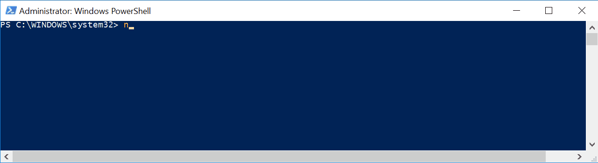

# New-Sleep



## SYNOPSIS  
Suspends the activity in a script or session for the specified period of time.

## DESCRIPTION
The New-Sleep cmdlet suspends the activity in a script or session for the specified period of time.
You can use it for many tasks, such as waiting for an operation to complete or pausing before repeating an operation.

## NOTES  
  - **File Name**  : New-Sleep.ps1
  - **Author**     : Thomas ILLIET, contact@thomas-illiet.fr
  - **Date**	     : 2017-05-10
  - **Last Update**: 2017-07-26
  - **Version**	   : 1.0.1

## INSTALL
```
PS> Install-Script -Name New-Sleep
```

## EXAMPLE
```
New-Sleep -S 60 -Message "wait and see"
```

```
New-Sleep -S 60
```
